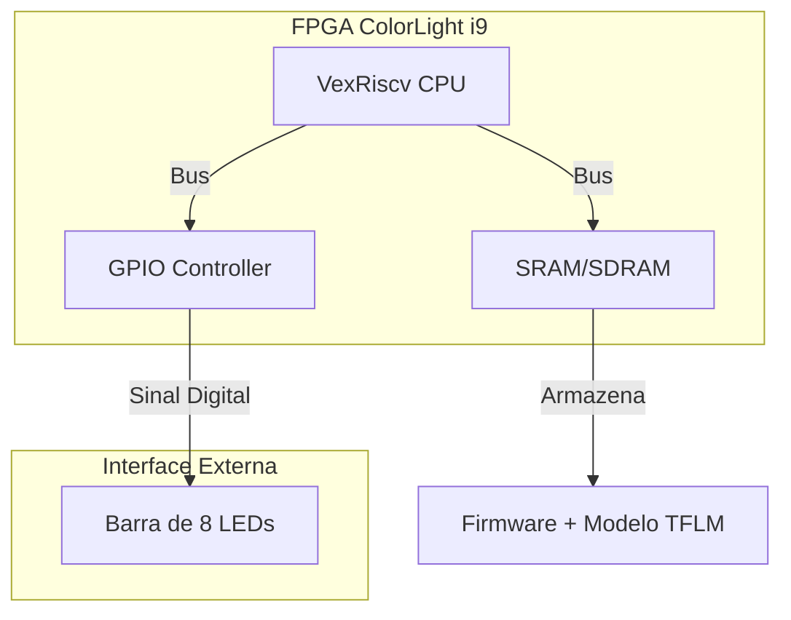

# Tarefa 06: TensorFlow Lite Micro em SoC LiteX (ColorLight i9)

Este projeto demonstra a execução de inferência de Machine Learning (TinyML) em um processador softcore **VexRiscv** instanciado em uma FPGA **ColorLight i9**.

O sistema executa o modelo **Hello World** (aproximação de seno) do TensorFlow Lite Micro, utilizando a saída inferida para controlar uma barra de 8 LEDs, criando um efeito visual proporcional ao valor calculado pela rede neural.

## Visão Geral do Sistema

O projeto consiste em um SoC (System on Chip) gerado via LiteX, contendo a CPU, memória e periféricos de I/O. O firmware, escrito em C++, carrega o runtime do TFLM e executa o modelo ciclicamente.

### Diagrama de Blocos Simplificado



## Hardware Utilizado

* **Placa FPGA:** ColorLight i9 (Lattice ECP5 - LFE5U-45F)
* **Interface:** Placa de extensão com Barra de 8 LEDs (conectada ao header J1)
* **Programador:** JTAG (via OpenOCD/EcpDap)

## 🔌 Pinagem (Pinout)

Os LEDs foram configurados no firmware como um vetor de 8 bits (`leds_ext`). A tabela abaixo relaciona o índice do bit no software com o pino físico no conector **CN2** da placa de extensão:

| Bit (Firmware) | Pino FPGA | Pino CN2 | Observação |
|----------------|-----------|----------|------------|
| LED 0 (LSB)    | P17       | 4        |            |
| LED 1          | P18       | 6        | Pula pino 5 (T17)|
| LED 2          | N18       | 8        | Pula pino 7 (GND)|
| LED 3          | L20       | 10       | Pula pino 9 (N17)*|
| LED 4          | L18       | 12       | Pula pino 11 (M18)*|
| LED 5          | G20       | 14       | Pula pino 13 (GND)|
| LED 6          | M18       | 11       | *Retorna na sequência|
| LED 7 (MSB)    | N17       | 9        | *Retorna na sequência|

*Atenção: A ordem física no conector não é linear para os últimos bits. Verifique as conexões individualmente.*

## 📂 Estrutura do Projeto

```text
├── firmware/               # Código-fonte do Firmware
│   ├── tflm/               # Biblioteca TensorFlow Lite Micro (Headers e Libs)
│   ├── linker.ld           # Script do Linker (Mapeamento de memória do VexRiscv)
│   ├── main.cc             # Código Principal (Setup do TFLM e Loop de Inferência)
│   ├── model.cc / model.h  # Modelo da Rede Neural (Array C quantizado)
│   ├── tarefa_6_...ipynb   # Notebook (Treinamento e Conversão do Modelo)
│   └── Makefile            # Script de Compilação do Firmware
├── litex/                  # Scripts de Geração do Hardware (Gateware)
│   └── colorlight_i5.py    # Script de configuração do SoC e Periféricos
└── README.md               # Documentação do Projeto
```

## 🚀 Como Compilar e Executar

### Pré-requisitos
* LiteX e Migen instalados
* Toolchain RISC-V (`riscv64-none-elf-g++`)
* Oss-Cad-Suite (Yosys, Nextpnr, OpenOCD)

### 1. Geração do Bitstream (Hardware)
Gera o Gateware para a FPGA ColorLight i9 com processador VexRiscv:

```bash
# Antes de qualquer coisa, garanta que está dentro do ambiente do Oss-Cad-Suite:
source ~/caminho/para/o/oss-cad-suite/envirioment

cd litex
python3 colorlight_i5.py --board i9 --revision 7.2 --build --cpu-type=vexriscv --ecppack-compress
```

### 2. Compilação do Firmware (Software)
Compila o firmware e da biblioteca `libtflm.a`:

```bash
cd ../firmware
make
```
Isso gerará o arquivo `main.bin`. A biblioteca `libtflm.a` já foi compilada e está no reposiório já compilada, mas para compila-la foi necessário apenas entrar na pasta `firmmware/tflm/` e executar o comando `make`.

*OBS: a biblioteca deve ser compilada antes do firmware, mas como já foi compilada, não há necessidade de realizar a compilação novamente.*

### 3. Carregamento
Para carregar o bitstream e o firmware via JTAG (exemplo usando OpenOCD):

```bash
cd ../litex

# Carregar o Gateware (Bitstream).
sudo caminho/encontrado -b colorlight-i5 build/colorlight_i5/gateware/colorlight_i5.bit

# Carregar o Firmware (via litex_term ou gdb, dependendo do setup)
litex_term --kernel ../firmware/build/main.bin /dev/ttyACMx
```

*OBS: onde está colocado como "caminho/encontrado" deve-se completar com o resultado do comando `which openFPGALoader`.*

## Sobre o Modelo (Machine Learning)

* **Modelo:** Hello World (Senoide).
* **Entrada:** Float (representando o ângulo).
* **Saída:** Int8 (Quantizado), mapeado para 0-255.
* **Lógica dos LEDs:** O valor de saída é normalizado para acender de 0 a 8 LEDs, criando uma barra de progresso que oscila conforme a onda senoidal gerada pela inferência.
